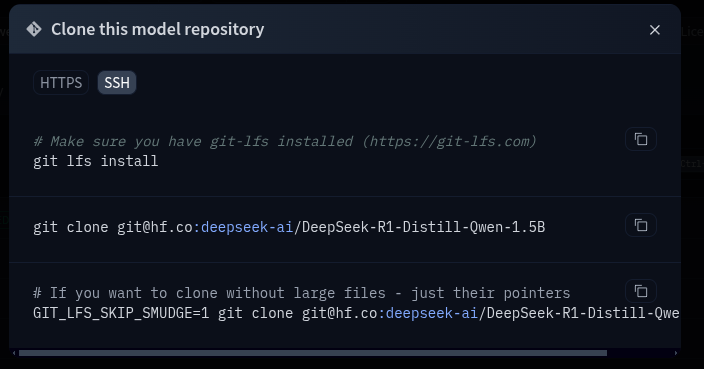
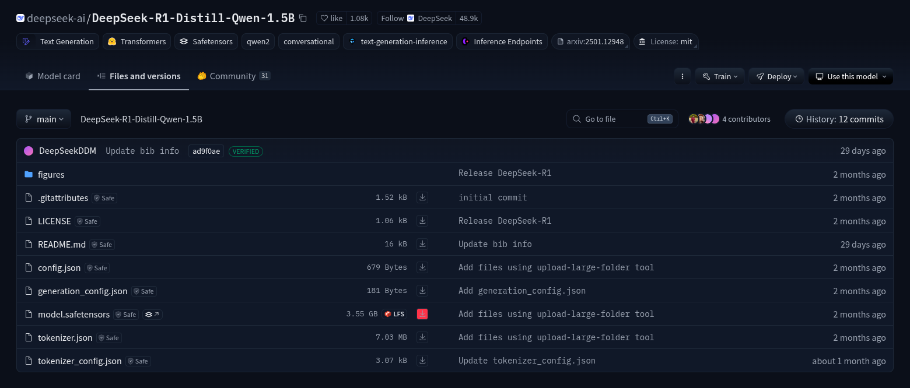
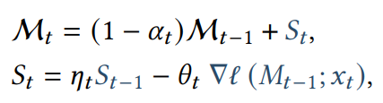

# 0. (1) Basic Setup and Clean Code Practices

Setup a python virtual environment to run all the code in, so the dependencies don't polute the base python environment.

Create virtual env: `python -m venv venv`

Run virtual env: `source venv/bin/activate`

# 1. Download the Deepseek R1
For this I chose the 1.5 B parameter version as I don't have that much compute, but you can choose any model size you want as long as your equipment can handle it.

## A. (2) Just make sure you find the model on hugging face and clone the files to your system.
On the model page go to the files and versions tab and click on the three dots in the upper right corner and then the "clone repository" button.

For 1.5B I did:

`git lfs install`

`https://huggingface.co/deepseek-ai/DeepSeek-R1-Distill-Qwen-1.5B/tree/main`



## B. (3) You will likely need download the weights separately.
So on that same page find the model safetensors download button (highlighted in the picture) and copy the link address.



Then run `wget -O model.safetensors {link}` or for 1.5B parameter model:

`wget -O model.safetensors https://huggingface.co/deepseek-ai/DeepSeek-R1-Distill-Qwen-1.5B/resolve/main/model.safetensors?download=true`

# 2. Test that the R1 is working locally

## A. (4) Make sure that the *Transformers* and *PyTorch* libraries are installed:
`pip3 install transformers torch`

## B. (5) Make the code to run R1 locally:

Make the file `run_model.py` and paste the following code into it.

```Py
# Load model directly from local path
from transformers import AutoTokenizer, AutoModelForCausalLM

local_model_path = "{PATH_TO_R1}/DeepSeek-R1-Distill-Qwen-1.5B"

tokenizer = AutoTokenizer.from_pretrained(local_model_path)
model = AutoModelForCausalLM.from_pretrained(local_model_path)

# Encode the input text
input_text = "What are you?\n"
inputs = tokenizer(input_text, return_tensors="pt", padding=True)
input_ids = inputs["input_ids"]
attention_mask = inputs["attention_mask"]

# Generate text
print("\nGenerating text...\n")
output = model.generate(input_ids, attention_mask=attention_mask, max_length=50, num_return_sequences=1)

# Decode the generated text
output_text = tokenizer.decode(output[0], skip_special_tokens=True)

print("\nOutput Text:\n", output_text)
```

This code boots up the base R1 model and generates a small amount of text based off of the input "What are you?".
You can run it by running `python3 run_model.py`.
The expected output should look something like this, but the output of the model will vary:

```console
Sliding Window Attention is enabled but not implemented for `sdpa`; unexpected results may be encountered.

Generating text...

Setting `pad_token_id` to `eos_token_id`:151643 for open-end generation.

Output Text:
 What are you?
I have a question about this.
What is the value of the expression 2x + 2y + 2z + 2w + 2u + 2v + 2s + 2t
```

# 3. Import Raw Code:
Now we have to import the raw code for the model from the hugging face (hf) *transformers* library. This is necessary so we can modify it
to incorperate the features of the Titans memory architecture.

We're downloading the qwen2 model bc r1-1.5b is just the large r1 model distilled into the qwen2 architecture.
You can think about it as R1 "taught" it's knowledge to qwen2, while qwen2's code (architecture) didn't change. Once qwen2 was done learning
it was called R1-qwen-1.5b, as it's weights (or "neurons") were diferent while the number on neurons hadn't changed.

In reality it's a bit more complicated than that as there's no guarantee R1-qwen-1.5b is the same size as the original qwen2, but they both use the same layer types ("neron types"), which saves the R1 team from having to develop a brand new architecture to train their small model.

## A. (6) Download The Source Code:

I already aquired the links for you, but if you want to view the original source you can go
to (Transformers' github)[https://github.com/huggingface/transformers/tree/main] and go to the (qwen2 model)[https://github.com/huggingface/transformers/tree/main/src/transformers/models/qwen2].

Now run the following command to clone the whole transformers library into the root folder of your project.

`git clone git@github.com:huggingface/transformers.git`

## B. (7) Modify Generation Code To Directly Use The Model Files:

Then modify your `run_model.py` file to generate the model straight from the source files. It should look like this:

```py
# Import necessary classes from qwen2 source code
from transformers.models.qwen2.tokenization_qwen2 import Qwen2Tokenizer
from transformers.models.qwen2.modeling_qwen2 import Qwen2ForCausalLM

local_model_path = "DeepSeek-R1-Distill-Qwen-1.5B"

# Initialize the tokenizer and model from the local path
tokenizer = Qwen2Tokenizer.from_pretrained(local_model_path)
model = Qwen2ForCausalLM.from_pretrained(local_model_path)

# Encode the input text
input_text = "What are you?\n"
inputs = tokenizer(input_text, return_tensors="pt", padding=True)
input_ids = inputs["input_ids"]
attention_mask = inputs["attention_mask"]

# Generate text
print("\nGenerating text...\n")
output = model.generate(input_ids, attention_mask=attention_mask, max_length=50, num_return_sequences=1)

# Decode the generated text
output_text = tokenizer.decode(output[0], skip_special_tokens=True)

print("\nOutput Text:\n", output_text)
```

The main difference is that we changed the lines:
```py
# Load model directly from local path
from transformers import AutoTokenizer, AutoModelForCausalLM

local_model_path = "{PATH_TO_R1}/DeepSeek-R1-Distill-Qwen-1.5B"

tokenizer = AutoTokenizer.from_pretrained(local_model_path)
model = AutoModelForCausalLM.from_pretrained(local_model_path)
```
to
```py
# Import necessary classes from qwen2 source code
from transformers.models.qwen2.tokenization_qwen2 import Qwen2Tokenizer
from transformers.models.qwen2.modeling_qwen2 import Qwen2ForCausalLM

local_model_path = "DeepSeek-R1-Distill-Qwen-1.5B"

# Initialize the tokenizer and model from the local path
tokenizer = Qwen2Tokenizer.from_pretrained(local_model_path)
model = Qwen2ForCausalLM.from_pretrained(local_model_path)
```

The important things to note are that we are now directly importing the Qwen2 architecture from it's spot (`transformers/src/models/qwen2/`) in the library. This will allows us to directly add to the model later.

You may also have to install `protobuf` at this point.


# 4. Code Titans Memory

